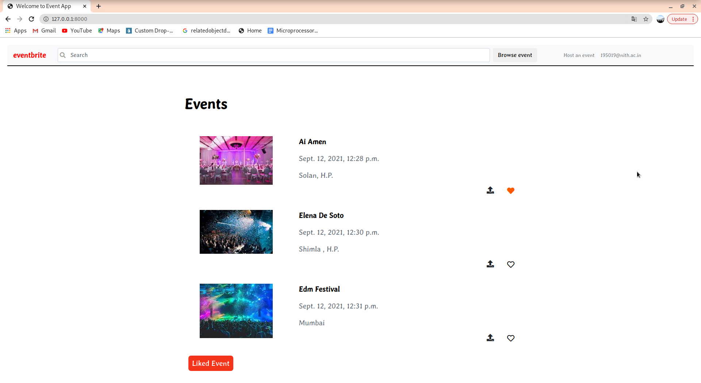
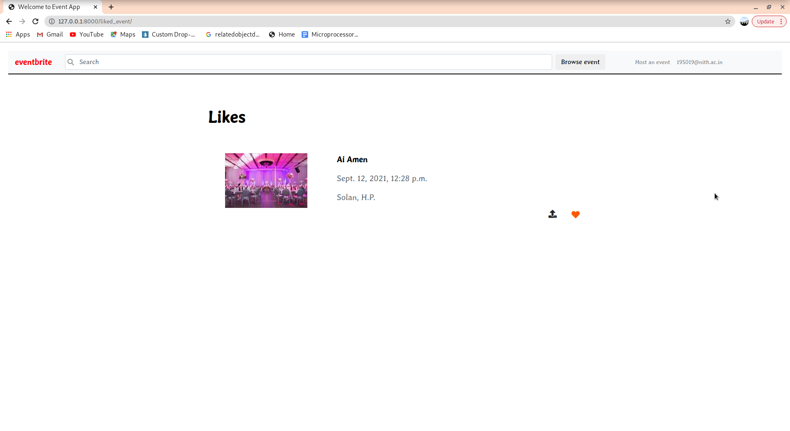
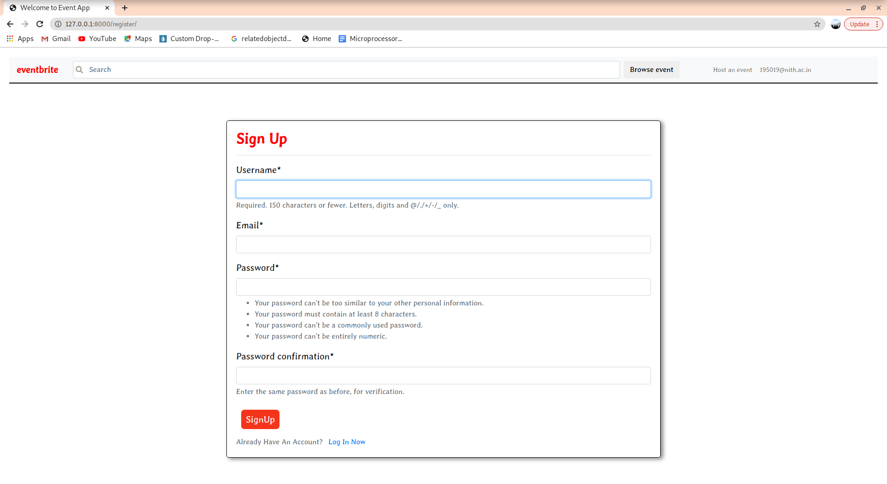
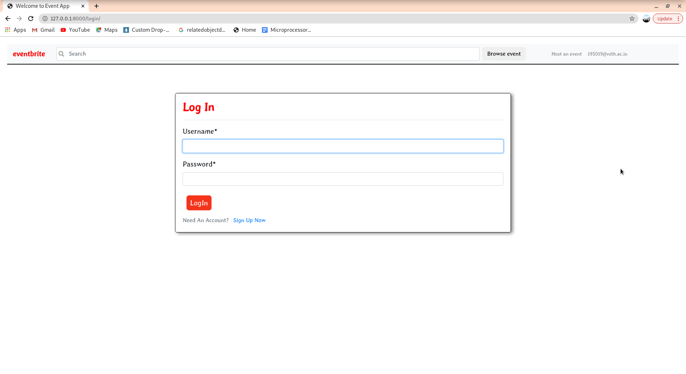

# eventmanager

## Liked Event Page

## Event Page
## Searched Event Page

## Register Page

## Login Page

ps : i have used cloudinary to store images.
To run project first activate virtual enviroment django_env and install the required package like cloudinary, django-crispy-forms, python3-dev libmysqlclient-dev default-libmysqlclient-dev, mysql, etc.
